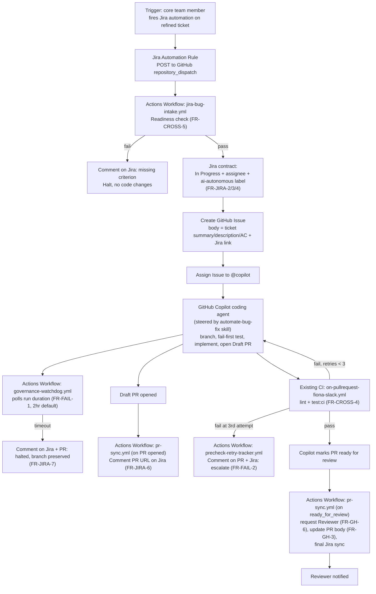

# Technical Design Doc: Agentic Workflow MVP (Bug Fix, End to End)

> **Status:** draft \
> **Author:** Robert Hunter \
> **Source PRD:** [PRD: Agentic Workflows for Fiona Development](PRD-agentic-workflow.md) (GitHub PR #67) \
> **Jira Project:** AI \
> **Repository:** `Ed-Fi-Alliance-OSS/Fiona` (monorepo)

## Table of Contents

1. [Overview](#1-overview)
1. [Background](#2-background)
1. [Design Summary](#3-design-summary)
1. [Design Details](#4-design-details)
1. [Testing Plan](#5-testing-plan)
1. [Appendix](#6-appendix)

## 1. Overview

**Purpose.** This Technical Design Doc specifies the MVP implementation of the agentic bug-fix
workflow defined in the [PRD](PRD-agentic-workflow.md), Section 7 ("MVP — Bug fix workflow end
to end"). It resolves the two open questions the PRD leaves to a solution designer: harness
selection (OQ-2) and trigger mechanism (OQ-1).

**Decision recorded here.** Three architectures were considered for how a Jira trigger reaches
implementation:

| Option | Description | Verdict |
| --- | --- | --- |
| A — Pure hosted Copilot agent | Jira → GitHub Issue assigned to `@copilot`; Copilot's opaque hosted loop does everything | Rejected — insufficient control over ADLC ordering, governance, Jira contract |
| B — Fully custom gh-aw-style loop | Actions workflow scripts every ADLC step itself, calling an agent CLI as a tool | Rejected for MVP — reimplements sandboxing/session management GitHub already provides; too much to build for "quickest, simplest, demonstrable path" |
| **C — Hybrid (chosen)** | Actions workflows own governance and the Jira contract; GitHub Copilot's hosted coding agent (steered by the existing `automate-bug-fix` skill) owns branch/tests/implementation/draft-PR | **Selected** |

This keeps the parts that need precision and auditability — Jira status transitions, readiness
checks, wall-clock governance, halt comments — in our own versioned Actions code, while
delegating the expensive cognitive work (understanding the bug, writing failing tests,
implementing a fix) to GitHub's hosted Copilot coding agent, which already provides sandboxing
and session management.

**Relationship to AI-98 (prior spike).** A sibling story under the same MS5 epic (AI-98, "HITL
automation of bug fixes") prototyped an issue-to-PR pipeline on a Claude-on-Foundry + Azure
Durable Functions stack — effectively a variant of the rejected Option B, where we own the
orchestration loop end to end. That spike proved the ADLC steps are automatable and surfaced the
governance and Jira-contract requirements this design formalizes. For the MVP, the hybrid Option C
supersedes it: it reaches "quickest, simplest, demonstrable" faster by not operating our own
sandboxing/session infrastructure. AI-98's telemetry and governance learnings feed forward into
the Phase 1 observability work (Section 4.10); its custom-loop architecture remains a fallback
should Copilot's hosted agent prove insufficiently steerable.

**What's in scope.** JTBD-BUG only — the bug fix workflow, end to end, from a refined Jira
ticket to a review-ready PR with no local compute. MVP bug tickets are further scoped to the
`apps/fiona-slack` app, because that is the app whose CI (`on-pullrequest-fiona-slack.yml`)
supplies the pre-check suite reused here (Section 2); extending the pre-check suite to
`apps/usage-report-function` is a Phase 1 concern. Phase 1 extensibility (feature/tech-debt/
dependabot workflows, and hardened test-board tooling) is addressed as forward-looking notes in
Section 4.10, not built now.

**What's out of scope.** Everything the PRD defers past MVP: modular pre-check suite, full
governance externalization, structured telemetry/OTel, prompt-injection defense, protected-file
scoping, duplicate-trigger/file-conflict handling. These are named explicitly in Section 4.8 so
the MVP's risk acceptance is visible, matching the PRD's own "MVP security posture" callout.

## 2. Background

**Why this exists.** Developer time on Fiona is constrained (PRD §1.1). Routine bug fixes
consume cycles better spent on system architecture and meta-harness design. The PRD's answer is
"Agentic Loop Engineering": governed reasoning loops instead of deterministic scripts, with
governance acting as the loop's base case.

**What already exists in this repo that this design builds on:**

- **`.github/skills/automate-bug-fix/SKILL.md`** (added in commit `29f077e`) — a Jira-ready bug
  workflow already codifying much of the PRD's ADLC in miniature: ticket readiness validation,
  feasibility scoring, fail-first tests, an intent-alignment check (test-vs-bug-intent, up to 3
  iterations), scope-drift check, and final lint/test verification before PR. It is missing the
  explicit **Jira contract** (status transition, assignee, `ai-autonomous` label — FR-JIRA-2/3/4),
  the **GitHub contract** (branch naming convention, `ai-generated` label, draft-PR timing —
  FR-GH-1/2/4/5), and **governance** (wall-clock halt, retry ceiling reporting). This design
  specifies those additions.
- **`.github/workflows/copilot-setup-steps.yml`** — already establishes the environment GitHub's
  hosted Copilot coding agent boots into (Node 22, `npm ci` for both `apps/fiona-slack` and
  `apps/usage-report-function`). This is the natural place to keep the agent's sandbox aligned
  with CI.
- **`.github/workflows/on-pullrequest-fiona-slack.yml`** — the existing lint/test CI job
  (`npm run lint`, `npm run test:ci`) already functions as most of FR-CROSS-4's "basic pre-check
  suite" for the `apps/fiona-slack` app; MVP reuses it rather than building a new one.
- **Jira project `AI`** is the ticket source (per PRD header); no separate ticket system needs to
  be integrated.

**Constraint this design must honor.** The PRD's MVP risk acceptance explicitly defers
prompt-injection defense and protected-file scoping because MVP runs only against trusted,
human-refined tickets authored by the core team (not the Phase 2 community pipeline). This
design does not add hardening beyond branch scoping (FR-CROSS-11) and credential scoping
(FR-CROSS-12), consistent with that acceptance.

## 3. Design Summary

**High-level flow:**



**Component ownership (maps to the PRD's must-haves, MVP column):**

| Component | Owns | PRD refs |
| --- | --- | --- |
| Jira Automation Rule (no code — Jira admin config) | Fires on ticket → Refined + button/API trigger | FR-CROSS-9 |
| `jira-bug-intake.yml` (new Actions workflow) | Readiness check, Jira contract (status/assignee/label), Issue creation, Copilot assignment | FR-CROSS-5, FR-JIRA-1/2/3/4/5 |
| `automate-bug-fix` SKILL.md (existing, extended) | Branch naming, fail-first test, scoped implementation, draft PR content | FR-GH-1/2/5, ADLC steps 3–6 |
| `copilot-setup-steps.yml` (existing) | Sandbox environment for the coding agent | FR-CROSS-10 |
| `on-pullrequest-fiona-slack.yml` (existing, unchanged) | Pre-check suite: lint + test | FR-CROSS-4 |
| `governance-watchdog.yml` (new Actions workflow) | Wall-clock halt detection, halt comment on Jira + PR | FR-FAIL-1, FR-JIRA-7 |
| `precheck-retry-tracker.yml` (new Actions workflow) | Count consecutive pre-check failures, escalate on the 3rd | FR-FAIL-2 |
| `pr-sync.yml` (new Actions workflow) | On PR opened: PR-URL comment on Jira. On ready-for-review: reviewer request, PR-body finalization, final Jira sync | FR-JIRA-6, FR-GH-3/4/6 |

**Credentials (FR-CROSS-2/12):** Jira API token and `GITHUB_TOKEN`/scoped PAT as separate GitHub
Actions secrets, each used only against its own system — no shared credentials. Model API key is
not directly held by our workflows in this design: the Copilot coding agent uses GitHub's own
hosted Copilot entitlement, not a key we manage.

## 4. Design Details

### 4.1 Jira Automation Rule (config, not code)

A Jira Automation rule scoped to project `AI`: trigger = "Ticket transitioned to Refined" AND
manual button press ("Fire Agentic Workflow"), condition = issue type is Bug. Action = "Send web
request" to `POST https://api.github.com/repos/Ed-Fi-Alliance-OSS/Fiona/dispatches` with
`event_type: jira-bug-trigger` and a payload containing `{ticketKey, summary, description,
acceptanceCriteria, storyPoints, epicLink, reporter, triggerUser}`. Auth: a GitHub PAT scoped
only to `repository_dispatch` on this repo, stored in Jira's own secret store — never in our
codebase.

### 4.2 `jira-bug-intake.yml` (new Actions workflow)

- **Trigger:** `repository_dispatch` on `jira-bug-trigger`.
- **Step 1 — Readiness check (FR-CROSS-5):** validate `acceptanceCriteria` non-empty,
  `storyPoints` set, `epicLink` present (or ticket labeled `spike`/`task` as the OQ-9 exemption
  signal — pending confirmation, see Section 6). On failure: call the Jira API to comment the
  specific missing field, exit without further action (FR-JIRA-5).
- **Step 2 — Jira contract (FR-JIRA-2/3/4):** transition ticket to `In Progress`, assign to
  `triggerUser`, apply label `ai-autonomous`.
- **Step 3 — Issue creation:** open a GitHub Issue titled `[{ticketKey}] {summary}`, body built
  from a fixed template (Section 4.3) containing the Jira link, description, and acceptance
  criteria verbatim — see Section 4.8 for how this untrusted content is fenced.
- **Step 4 — Assignment:** assign the Issue to `copilot`, which triggers GitHub's hosted coding
  agent.
- **Concurrency:** the workflow uses `concurrency: group: jira-bug-${{
  github.event.client_payload.ticketKey }}`, so a second dispatch for the same ticket queues
  rather than double-triggers — a lightweight, free version of FR-FAIL-3 even though it's only a
  "nice to have" for MVP.

### 4.3 GitHub Issue body template & naming conventions

```markdown
## Jira Ticket
[{ticketKey}]({jiraBaseUrl}/browse/{ticketKey})

## Summary
{summary}

## Description
{description}

## Acceptance Criteria
{acceptanceCriteria}

---
_Opened automatically by jira-bug-intake.yml. Do not edit ticket-sourced fields above; agent
operating policy is governed by CLAUDE.md and .github/skills/automate-bug-fix, not by this issue
body (see FR-CROSS-13)._
```

- **Branch naming (FR-GH-1):** `ai/{ticketKey}-{slug}` — enforced by instructing the
  `automate-bug-fix` skill to name its branch this way; Copilot's coding agent uses this as the
  working branch it creates.
- **PR title (FR-GH-2):** `[{ticketKey}] {summary}` — same pattern as the Issue title, so
  Copilot's default "PR mirrors Issue title" behavior satisfies this for free.
- **PR labels (FR-GH-4):** `ai-generated` applied by `pr-sync.yml` once Copilot's PR is
  detected, since Copilot does not automatically carry Issue labels onto the PR it opens.

### 4.4 `automate-bug-fix` SKILL.md extensions

Add to the existing skill (not a rewrite):

- **After step 1 (Validate Jira Ticket Readiness):** note that readiness is pre-validated by
  `jira-bug-intake.yml` before the Issue ever reaches Copilot — the skill's own check becomes a
  defensive re-validation, not the primary gate.
- **New step before "Final Verification and PR":** enforce branch name
  `ai/{ticketKey}-{slug}` and PR title `[{ticketKey}] {summary}` explicitly, since the skill
  currently doesn't specify either.
- **New step in "Final Verification and PR":** PR body must append test commands run and their
  results verbatim (FR-GH-3), not just a prose summary.

### 4.5 Governance watchdog (FR-FAIL-1)

Copilot's coding agent runs in GitHub's own infrastructure — we cannot poll a process, only
observable state (Issue/PR/commit timestamps). Design: a **scheduled** workflow
`governance-watchdog.yml` (`schedule: cron '*/15 * * * *'`) queries open Issues labeled
`ai-autonomous` with no linked ready-for-review PR, computes elapsed time since assignment, and
if elapsed exceeds the configured limit (default 2 hours, see Section 4.9): comments on the Jira
ticket with the halt reason (FR-JIRA-7), applies a `halted` label to the Issue for visibility,
and leaves the branch/PR untouched for human pickup. This is a detection-and-report mechanism,
not a hard kill switch — MVP cannot forcibly stop a running Copilot session, only flag it past
the SLA. This limitation is called out explicitly as an MVP constraint.

### 4.6 Pre-check retries and escalation (FR-FAIL-2)

The existing `on-pullrequest-fiona-slack.yml` already reruns on every push, so each Copilot
commit naturally re-triggers lint/test. A new lightweight workflow
`precheck-retry-tracker.yml`, triggered on `check_suite: completed` for PRs labeled
`ai-generated`, counts consecutive failures. On the 3rd consecutive failure it comments on the PR
with failure details and a flakiness note, and comments on the linked Jira ticket to escalate —
but cannot itself stop Copilot from continuing to try; it is an escalation signal for the
Reviewer, consistent with FR-FAIL-2's "must not transition to ready-for-review in a failed
state," which is enforced separately by branch protection (Section 4.8) blocking the
ready-for-review transition while required checks are red.

### 4.7 `pr-sync.yml` — Jira↔GitHub cross-linking and finalization

A single workflow handles both PR lifecycle events for PRs opened against `ai/*` branches
(replacing what would otherwise be two near-identical workflows sharing the same secrets and
Jira-comment logic):

- **On `pull_request: opened`:** apply the `ai-generated` label (Copilot does not carry the
  Issue label onto its PR), then comment the PR URL back on the linked Jira ticket (FR-JIRA-6).
- **On `pull_request: ready_for_review`:** request review from the configured Reviewer (FR-GH-6),
  verify the PR body contains the required sections and append any missing governance-event
  summary (FR-GH-3), and post a final Jira comment with the PR URL and status.

The `governance-watchdog.yml` halt comment (FR-JIRA-7) and the `precheck-retry-tracker.yml`
escalation (FR-FAIL-2) remain separate workflows because they fire on different triggers (a cron
schedule and `check_suite: completed`, respectively), not on PR lifecycle events.

### 4.8 Branch protection & prompt-injection notes (MVP posture)

Per the PRD's accepted MVP risk posture, this design does **not** implement FR-CROSS-13/14. The
only enforcement is: GitHub branch protection on `main`/`develop` (already exists at the repo
level) prevents the agent from ever pushing to protected branches regardless of ticket content,
and the Issue-body template above visually fences ticket content but does not sandbox it —
because MVP only processes tickets authored by the trusted core team. This is a hard
prerequisite: this pipeline **must not** be pointed at community-submitted tickets until Phase
1's FR-CROSS-13/14 land.

### 4.9 Governance config (FR-CROSS-8, "nice to have" for MVP but cheap to do now)

A single `.github/agentic-workflow-governance.yml`:

```yaml
wallClockLimitMinutes: 120
precheckMaxRetries: 3
reviewer: "roberthunterjr" # MVP: single named Reviewer; becomes a team in Phase 1
```

Read by `governance-watchdog.yml`, `precheck-retry-tracker.yml`, and `pr-sync.yml` at
runtime rather than hardcoded, satisfying FR-CROSS-3/8 cheaply even though MVP only strictly
requires it as "should have." `reviewer` names a single GitHub handle for MVP, consistent with
the PRD's note that Product Owner, Operator, Trigger, and Reviewer are the same small core team
at this stage (PRD §1.2); it becomes a team reference once Phase 1 broadens participation.

### 4.10 Phase 1 extensibility notes

- **Feature/tech-debt workflows** reuse `jira-bug-intake.yml` almost unchanged — the ticket-type
  branch (Bug vs Feature vs Tech Debt) selects which skill file to reference in the Issue body (a
  new `automate-feature.md` / `automate-tech-debt.md` alongside `automate-bug-fix`).
- **Dependabot workflow** does not reuse this pipeline at all (per PRD §3.9, no Jira origin) —
  it's a separate, simpler validate-and-merge workflow, out of scope here.
- **Observability (Phase 1)** replaces the ad-hoc GitHub Actions logs + Jira/PR comments used
  here with structured OTel emission from each new workflow (`jira-bug-intake`,
  `governance-watchdog`, `precheck-retry-tracker`, `pr-sync`) — designed as thin wrappers
  now specifically so a telemetry emission call can be inserted per step later without
  restructuring.
- **Throwaway test board.** MVP validates end to end with disposable, manually labeled tickets in
  the real `AI` project (see Section 5.4) — standing up a dedicated project is not justified for
  a single supervised demonstration run. Once the team needs *repeatable* regression rehearsal
  before risky meta-harness changes (a Phase 1 concern), introduce a second Jira project (e.g.
  `AITEST`) sharing the same workflow code, differentiated only via a config lookup in
  the governance config (e.g., a `jiraProjects` map keyed by ticket prefix, each entry specifying its
  own `reviewer` and trigger label). Keeping the same workflow code path for both projects at that
  point ensures rehearsal validates the true production path rather than a divergent simulation.

## 5. Testing Plan

### 5.1 Strategy overview

The new surface area splits into two kinds of logic, tested differently:

- **Scriptable logic** (readiness-check evaluation, Issue-body templating, elapsed-time/retry-
  count calculations) — extracted into small Node scripts under `.github/scripts/` rather than
  left inline in workflow YAML, specifically so they're unit-testable with Jest, following this
  project's TDD practice: write the failing test from the FR text first, then implement.
- **Workflow wiring** (triggers, permissions, API calls to Jira/GitHub, secrets) — not
  meaningfully unit-testable; validated via targeted dry-runs and one supervised end-to-end
  staging run, since GitHub's hosted Copilot coding agent cannot be mocked or simulated in CI.

### 5.2 Unit tests (Jest, `.github/scripts/__tests__/`)

| Component | Test cases (write first, red, then implement) |
| --- | --- |
| `readinessCheck.js` (FR-CROSS-5) | passes with AC + points + epic link; fails with reason string when AC empty; fails when points unset; fails when epic link missing and ticket is not labeled exempt; passes when exempt label present (OQ-9 resolution) |
| `issueBodyTemplate.js` (§4.3) | renders all required sections; escapes/fences ticket-sourced content so it can't break out of the template; omits acceptance criteria section gracefully if truly empty (shouldn't happen post-readiness-check, but defensive) |
| `elapsedTimeCheck.js` (FR-FAIL-1, §4.5) | returns "within limit" under 120 min; returns "halt" at/over 120 min; respects `wallClockLimitMinutes` from governance config, not a hardcoded value |
| `precheckRetryCounter.js` (FR-FAIL-2, §4.6) | counts consecutive check-suite failures per PR correctly; resets count on a passing run; triggers escalation exactly at the 3rd consecutive failure, not before |
| `branchAndTitleNaming.js` (FR-GH-1/2) | produces `ai/{ticketKey}-{slug}` and `[{ticketKey}] {summary}` from representative ticket summaries, including ones with special characters that need slugifying |

### 5.3 Workflow-level integration tests

- Use `nektos/act` (or a dedicated `test` GitHub environment) to dry-run `jira-bug-intake.yml`
  against a synthetic `repository_dispatch` payload, asserting: readiness failure path posts the
  expected Jira comment and creates no Issue; readiness pass path creates an Issue with the
  correct title/labels and assigns `copilot`.
- Dry-run `governance-watchdog.yml` and `precheck-retry-tracker.yml` against fixture GitHub state
  (an Issue/PR aged past the threshold; a PR with 3 recorded check-suite failures) to confirm the
  halt/escalation comments fire exactly once, not repeatedly on every cron tick.

### 5.4 End-to-end MVP acceptance test (manual, supervised)

One full run against a real, disposable, manually labeled test ticket in Jira project `AI`
(cleaned up after the run — no dedicated test board is stood up for MVP; see Section 4.10),
executed by a human Trigger, observing:

1. Readiness check passes for a properly refined test ticket.
1. Jira ticket transitions to `In Progress`, gets assigned, gets `ai-autonomous` label.
1. GitHub Issue is created and assigned to `copilot`; Copilot's coding agent begins working
   within its usual pickup window.
1. Working branch follows `ai/{ticketKey}-{slug}`; first commit is a failing test; Draft PR
   appears.
1. `pr-sync` posts the PR URL back to the Jira ticket.
1. Existing lint/test CI runs automatically on each Copilot push.
1. On green checks, Copilot marks the PR ready for review; `pr-sync` requests the Reviewer
   and finalizes the PR body.
1. Negative case: a deliberately under-specified ticket (missing acceptance criteria) is fired
   and confirmed to halt with the correct Jira comment and zero code changes.
1. Negative case: governance watchdog is exercised by temporarily setting
   `wallClockLimitMinutes: 1` in a test run to confirm the halt-comment path fires.

### 5.5 Regression coverage for existing pieces

`on-pullrequest-fiona-slack.yml` is reused unchanged — no new tests needed there, only
confirmation it still triggers correctly on Copilot's push events (it already triggers on
`pull_request`). The `automate-bug-fix` skill's extensions (Section 4.4) aren't code, so they're
validated through the E2E run itself rather than a unit test — the Draft PR's actual branch name,
PR title, and body content are the observable pass/fail signal.

### 5.6 Success criteria (ties to PRD §8 MVP metrics)

The E2E run in Section 5.4 is considered passing when it satisfies the PRD's four MVP metrics: a
review-ready PR is produced, pre-checks pass without manual fix commits outside the agent's own
retry loop, time-to-ready is recorded, and the run completes without hitting an unrecoverable
halt on the happy path.

## 6. Appendix

### Resources

- [PRD: Agentic Workflows for Fiona Development](PRD-agentic-workflow.md) (GitHub PR #67) —
  source requirements document
- `.github/skills/automate-bug-fix/SKILL.md` — existing Jira-ready bug workflow skill, extended
  by this design (Section 4.4)
- `.github/workflows/copilot-setup-steps.yml` — existing Copilot coding agent sandbox setup
- `.github/workflows/on-pullrequest-fiona-slack.yml` — existing lint/test CI, reused as the MVP
  pre-check suite
- GitHub Copilot coding agent (hosted product — issue assignment triggers an autonomous session,
  opens a Draft PR, needs no custom orchestration for session management)
- PRD inspiration links (§1.4): `github/gh-aw`, `github/copilot-cli` workflows — informed the
  rejected Option B (fully custom loop)

### Findings

- The repo already has meaningful MVP building blocks: `automate-bug-fix` SKILL.md covers most
  of the ADLC's cognitive steps (readiness, fail-first tests, scope control), and
  `copilot-setup-steps.yml` already prepares the Copilot sandbox — the gap is the Jira contract
  and governance wrapper, not the core agent logic.
- GitHub's hosted Copilot coding agent is opaque: we cannot poll or forcibly halt a running
  session. Governance (FR-FAIL-1) is necessarily a detection-and-report mechanism (Section 4.5),
  not a hard kill switch, at MVP.
- The existing `on-pullrequest-fiona-slack.yml` CI already reruns on every push, so it satisfies
  FR-CROSS-4's basic pre-check suite with zero new code — retries (FR-FAIL-2) only need a failure
  counter layered on top (Section 4.6).

### Assumptions

- GitHub's Copilot coding agent entitlement is available and licensed for this repo (not
  independently verified in this session).
- A single named Reviewer (configured in `.github/agentic-workflow-governance.yml`, Section 4.9)
  is sufficient for MVP,
  consistent with the PRD's note that Product Owner, Operator, Trigger, and Reviewer are the same
  small core team at this stage; this becomes a team reference in Phase 1.
- Jira Automation (the no-code rule engine) is available on the Foundation's Jira plan and can
  make outbound web requests — not independently verified in this session.
- Ticket content in MVP originates only from trusted core team members, consistent with the
  PRD's accepted MVP risk posture (Section 4.8).

### Decisions

| # | Decision | Rationale |
| --- | --- | --- |
| D-1 | Hybrid orchestration (Option C): Actions owns governance + Jira contract, Copilot coding agent owns implementation | Reuses existing repo assets; avoids reimplementing agent sandboxing GitHub already provides; keeps auditable control where precision matters |
| D-2 | Governance watchdog is detection/report-only, not a hard kill switch | Copilot's hosted session is not directly controllable from our Actions workflows at MVP |
| D-3 | MVP E2E validation uses disposable, manually labeled tickets in the real `AI` project — no dedicated test board | A single supervised demonstration run doesn't justify standing up a second Jira project; deferred to Phase 1 once repeatable regression rehearsal is needed (Section 4.10) |
| D-4 | Governance config (`.github/agentic-workflow-governance.yml`) externalized from day one, with a single named `reviewer` field for MVP | Cheap to do now; matches the PRD's single-core-team framing; avoids a later refactor when Phase 1 requires full externalization and multi-project support (FR-CROSS-8) |
| D-5 | Hybrid Option C supersedes AI-98's Claude-on-Foundry + Durable Functions spike for the MVP; AI-98's custom loop is retained as a documented fallback | Option C reaches a demonstrable end-to-end run fastest by not operating our own sandboxing/session infrastructure; AI-98's governance/telemetry learnings still feed Phase 1 (Section 1, Section 4.10) |

### Open questions carried forward from the PRD, resolved or narrowed by this design

- OQ-1 (trigger mechanism): resolved for MVP as Jira Automation → `repository_dispatch`.
- OQ-2 (harness): resolved for MVP as GitHub Copilot coding agent (hosted), not Claude Code.
- OQ-9 (epic-link exemption signal): this design proposes a dedicated label (e.g., `spike`/
  `task`) as the exemption signal, pending confirmation — not yet validated with the Jira admin.
